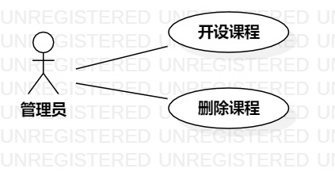

# 实验二：用例建模

## 一、实验目标  
- 选题并用例建模  
- 编写用例规约    

## 二、实验内容  
- 完成选题  
- 根据选题创建用例图  
- 编写实验报告文档  

## 三、实验步骤  
- 选题——课程管理系统  
- 创建Actor——管理员  
- 创建Use Case——增加课程  
- 创建Use Case——删除课程  
- 用Association将Actor和Use Case连接起来  
- 编写用例规约  

## 四、实验结果  

  
图1：课程管理系统的用例图  

## 表1：增加课程用例规约  

用例编号  | UC01 | 备注  
-|:-|-  
用例名称  | 开设课程  |   
前置条件  | 管理员登陆课程管理系统开课页面     | *可选*   
后置条件  |      | *可选*   
基本流程  | 1. 管理者点击开课按钮  |*用例执行成功的步骤*    
~| 2. 系统显示开课页面  |   
~| 3. 管理员输入课程信息，点击确认按钮   |   
~| 4. 系统查询课程信息，检查未存在相同课程，保存课程信息，提示“开课成功”  |   
~| 5. 系统显示开课页面   |  
扩展流程  | 4.1 系统检查存在相同课程，提示“该课程已存在”   |*用例执行失败*    
~| 4.2 系统返回开课页面   |  

## 表2：删除课程用例规约  

用例编号  | UC02 | 备注  
-|:-|-  
用例名称  | 删除课程  |   
前置条件  | 管理员登陆课程管理页面     | *可选*   
后置条件  |      | *可选*   
基本流程  | 1. 管理员输入课程名程，点击删除课程按钮  |*用例执行成功的步骤*    
~| 2. 系统查询课程信息，检查课程存在，删除课程信息，提示“删除成功”   |   
~| 3. 系统显示课程管理页面  |  
扩展流程  | 2.1 系统发现课程不存在，提示“删除失败，该课程不存在”  |*用例执行失败*    
~| 2.2 系统显示课程管理页面   |  
